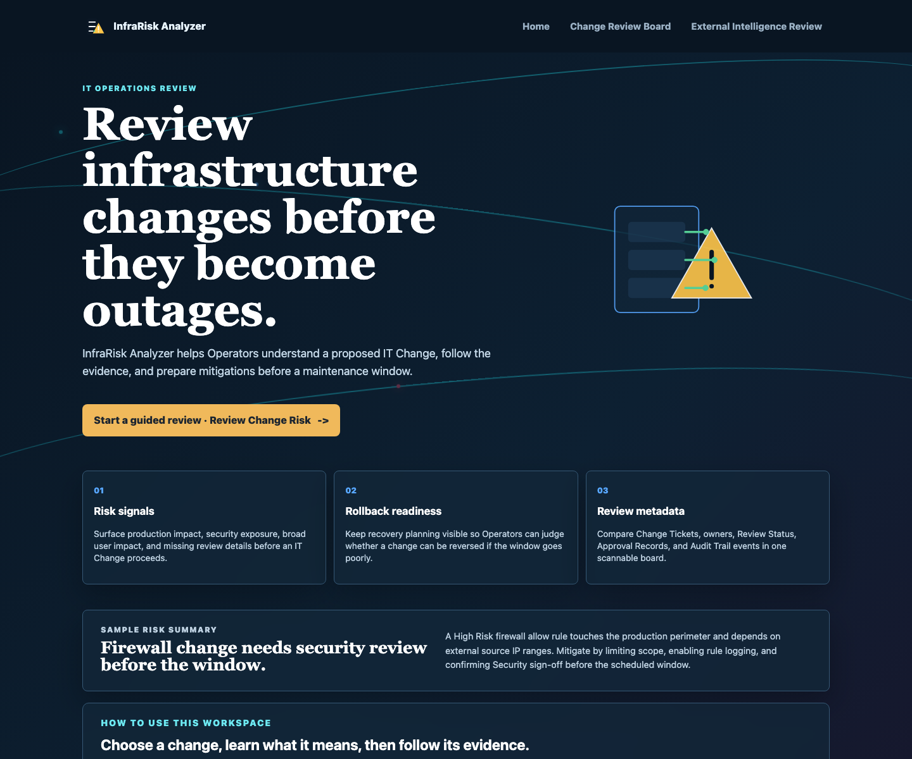
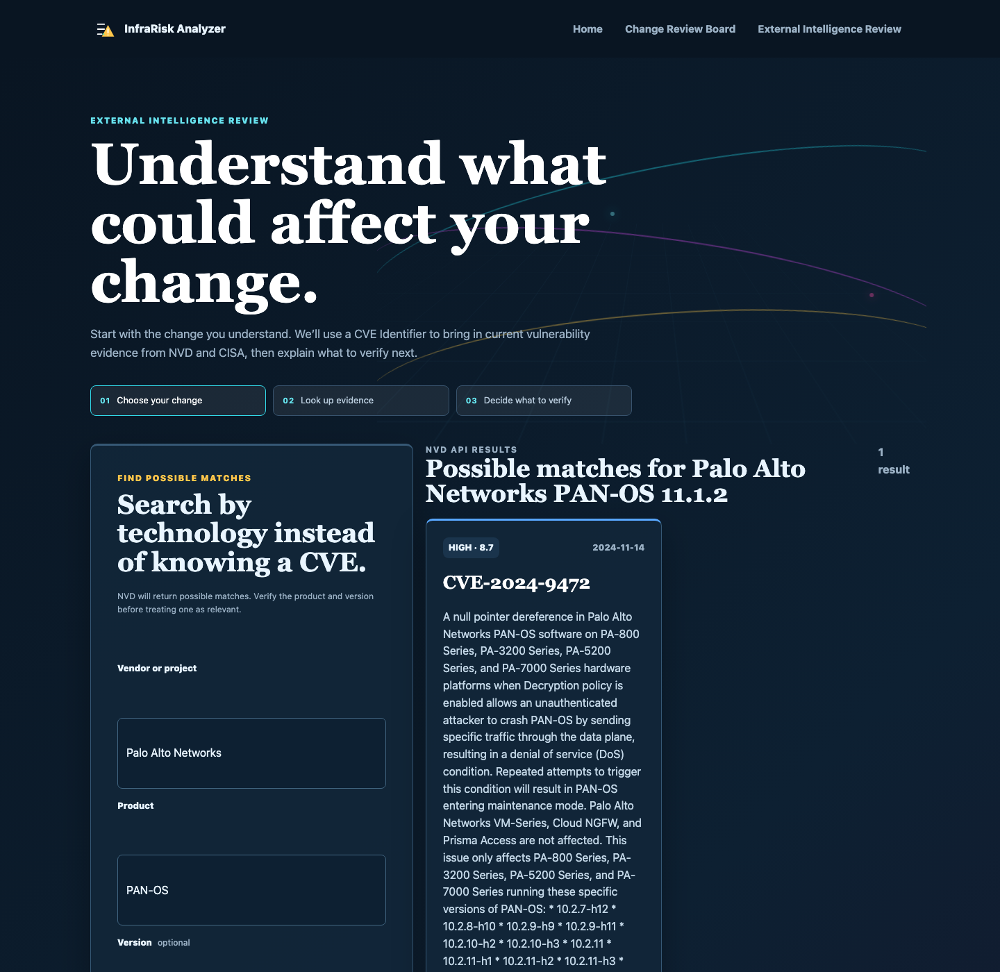
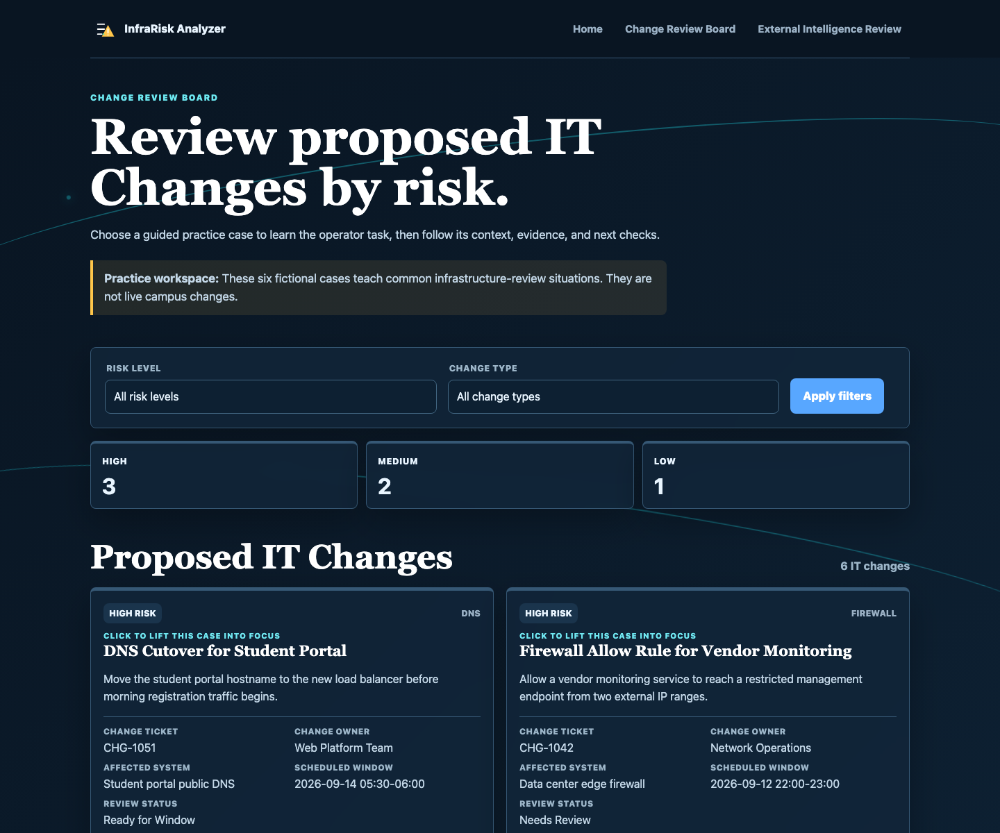

# Isaac Lares, COURSE: IT401, Assignment: A2

# Application Name: InfraRisk Analyzer

## Project Overview

**Review infrastructure changes before they become outages.**

InfraRisk Analyzer is a Flask application for junior sysadmins, network-ops practitioners, and DevOps learners. It extends the locally stored Assignment 1 Change Review Board with request-time External Intelligence: an Operator selects an IT Change, enters a CVE Identifier, and reviews current evidence from the National Vulnerability Database (NVD) and CISA's Known Exploited Vulnerabilities (KEV) catalog.

The application keeps source facts separate from the Operator's manually assigned Risk Level. External Intelligence informs a Change-Risk Review; it does not approve, block, or modify an IT Change.

> Demonstration data, not a production change-management or approval system. The IT Changes are fictional, and the application is not an approval authority.

## External Information Sources

- **NVD CVE API 2.0** — API endpoint: `https://services.nvd.nist.gov/rest/json/cves/2.0`. The application sends the normalized Operator-provided `cveId`, authenticates with the `NVD_API_KEY` header, and extracts the CVE Identifier, English description, publication date, best available CVSS metric, and NVD record URL.
- **CISA Known Exploited Vulnerabilities catalog** — webpage: `https://www.cisa.gov/known-exploited-vulnerabilities-catalog`. The application retrieves the public HTML catalog with the normalized CVE Identifier as `search_api_fulltext`, parses the expected table, and extracts exact-match vendor/project, product, vulnerability name, dates, required action, and source URL.

NVD supplies the technical vulnerability record. CISA supplies an independent exploitation and remediation signal. Together they support one review question: what current vulnerability evidence should an Operator consider before an infrastructure change proceeds?

## Application Workflow

1. The Operator opens **External Intelligence Review** and selects a locally stored IT Change.
2. The Operator can search by vendor, product, and optional version. NVD returns possible CVE matches and the interface explains why each result appeared.
3. The Operator chooses **Review evidence** for one candidate, or uses the secondary exact-CVE lookup when a CVE is already known.
4. `NvdService` sends the authenticated JSON request to NVD, checks the status code, and normalizes only fields relevant to the review.
5. `CisaKevService` retrieves the CISA webpage only for the selected CVE, cleans table text, matches the exact identifier, and normalizes the useful catalog fields. A short process-local cache reduces repeated catalog requests.
6. The selected local IT Change, NVD evidence, and optional CISA evidence are integrated into one page.
7. Guided questions separate source facts from Operator interpretation: verify applicability, consider the severity or known-exploitation signal, and coordinate mitigation and rollback review.
8. The page shows source attribution, retrieval timestamps, technical details, and explicit limits. External evidence does not change the IT Change's Risk Level, Review Status, Approval Records, or Audit Trail.

## Information Model

### Locally stored IT Change

The six fictional records in `data/it_changes.json` provide the review context: `title`, `change_type`, `risk_level`, `affected_system`, `scheduled_window`, `summary`, `risk_signals`, `mitigation`, `rollback_plan`, `change_owner`, `change_ticket`, `review_status`, `approval_records`, and `audit_trail`.

### Request-time External Intelligence

- **NVD evidence** (`NvdEvidence` in `services/nvd_service.py`): `cve_id`, English `description`, `published`, best available `cvss_version`, `cvss_score`, `cvss_severity`, NVD `source_url`, and `retrieved_at`. These fields come from the NVD JSON response.
- **CISA evidence** (`CisaKevEvidence` in `services/cisa_kev_service.py`): `cve_id`, `vendor_project`, `product`, `vulnerability_name`, `date_added`, `due_date`, `required_action`, catalog `source_url`, and `retrieved_at`. These fields come from the CISA HTML table.

The application does not currently persist either evidence record. The selected Affected System is context supplied by the local IT Change; the application does not infer that the system runs the vulnerable product or version.

## Environment Variables

| Variable | Required | Purpose |
| --- | --- | --- |
| `NVD_API_KEY` | Yes for a successful NVD lookup | Authenticates requests to NVD. Never commit a real value. |
| `NVD_API_URL` | No | Overrides the NVD endpoint for testing; defaults to the documented NVD API 2.0 endpoint. |
| `CISA_KEV_URL` | No | Overrides the CISA catalog URL for testing; defaults to the public catalog webpage. |
| `SECRET_KEY` | No for the demonstration | Flask secret configuration; the development default must be replaced for a deployed service. |

`API_KEY` and `AI_SERVICE_API_KEY` remain legacy configuration names and are not used by the A2 workflow. Copy `.env.example` to `.env`, add the NVD key, and keep `.env` uncommitted. The current app also accepts equivalent exported shell variables.

## Installation Instructions

The application supports Python 3.10 or newer.

```bash
python3 -m venv .venv
source .venv/bin/activate
pip install -r requirements.txt
cp .env.example .env
```

Edit `.env` and replace `replace-with-your-nvd-api-key` with an NVD API key. Do not place credentials in source code, screenshots, tests, logs, or commits. If the shell does not load `.env` automatically, export the variable before starting Flask:

```bash
export NVD_API_KEY="your-real-key"
python app.py
```

Open [http://127.0.0.1:5000](http://127.0.0.1:5000). Run the automated checks with:

```bash
python3 -m pytest -q
```

The tests mock external responses and therefore do not require a network connection or real credential.

## Current Features

- Assignment 1 Change Review Board with local fictional IT Changes, Risk Level filters, review metadata, mitigations, and rollback plans.
- User-controlled External Intelligence discovery by local Change Ticket, vendor, product, and optional version.
- NVD keyword search cards with relevance context, “Why this appeared” explanations, and explicit Review Evidence actions.
- Secondary exact-CVE lookup for vendor advisories or known vulnerability identifiers.
- Authenticated NVD JSON API integration with finite timeouts and normalized evidence.
- CISA KEV public webpage scraping with table-header validation, whitespace cleaning, exact CVE matching, normalized evidence, and process-local caching.
- One combined review page containing local change context, NVD evidence, CISA evidence, source attribution, retrieval timestamps, and guided interpretation.
- Explicit distinction between source facts and Operator judgment; External Intelligence never changes a manually assigned Risk Level.
- Friendly handling for invalid input, unknown Change Tickets, missing credentials, API errors, rate limiting, network failures, empty NVD results, malformed JSON, changed CISA HTML, and partial results.

## Error Handling

The application presents an understandable state instead of exposing a traceback:

- Invalid CVE input is rejected before an outbound request with a format hint.
- Invalid discovery input, empty NVD discovery results, and discovery source failures return guided messages without hiding the manual CVE path.
- An unknown Change Ticket returns a not-found page explaining that the Operator must choose a locally stored IT Change.
- A missing `NVD_API_KEY` returns a configuration message and HTTP 503.
- NVD HTTP 429 returns a retry-later message; other unsuccessful responses, network failures, malformed JSON, or missing response fields return a source-unavailable message.
- An empty NVD result returns a no-record message.
- CISA non-2xx responses, network failures, malformed rows, missing expected table headers, and changed HTML return an unavailable state rather than a false “not listed” claim.
- If NVD succeeds but CISA is unavailable, the page preserves the NVD evidence and clearly says that CISA listing status cannot be determined.
- If CISA succeeds without an exact match, the page says “not listed” only for the queried catalog snapshot and warns that this is not proof of safety or non-exposure.

## Ethical Considerations

The interface attributes NVD and CISA and links back to both source records. NVD requests use the documented API endpoint, an API key, a descriptive User-Agent, and a finite timeout. Operators should respect NVD terms, rate limits, and retry guidance; the application does not poll continuously. CISA requests are limited to the public catalog, use a descriptive User-Agent, and are cached for 15 minutes per catalog URL and CVE in the running process to reduce repeated retrieval.

The scraper extracts only the public table fields needed for a change-risk review and does not collect personal information. The project should continue to follow the source site's `robots.txt`, terms of use, licensing, and reasonable request-frequency constraints if the source changes. Source attribution does not transfer ownership of source data to this project, and External Intelligence is evidence for human review rather than a claim that a system is compromised or vulnerable.

## Known Limitations

- NVD and CISA evidence are request-time context and are not retained as External Intelligence Snapshots.
- The 15-minute CISA cache is process-local: it disappears on restart and is not shared between workers.
- External-source schemas, availability, rate limits, and HTML layout can change; the application cannot guarantee freshness or uninterrupted retrieval.
- A CVE match does not establish that the selected Affected System uses the affected product or version.
- NVD's CVSS signal and CISA's Known Exploited Vulnerability status do not automatically raise the local Risk Level or determine approval.
- The six IT Changes and their metadata are demonstration data, and the application is not a production change-management or approval system.

## Screenshots

The screenshots are checked-in browser captures from the application. The external-review capture was produced with deterministic local source fixtures, so it contains no credential and does not depend on a live source during documentation review.

### Homepage



### Combined guided review, NVD evidence, and scraped CISA evidence



The combined capture is labeled in-page: the “Guided interpretation” panel demonstrates the integrated review, “NVD API evidence” demonstrates the JSON source, and “CISA KEV catalog evidence” demonstrates the scraped webpage source.

### Change Review Board



## Future Work

Assignment 3 can add persistent IT Changes, Risk Findings, Approval Records, Audit Trail events, and timestamped External Intelligence Snapshots. A snapshot should retain the normalized source evidence, source URLs, retrieval timestamps, selected Change Ticket, and the Operator's review context without turning external evidence into automatic approval or blocking logic.

## Project Structure

```text
app.py                       Flask application factory and entry point
config.py                    Environment-aware configuration
data/it_changes.json         Six fictional IT Change records
models/__init__.py           IT Change and Approval Record models
routes/main.py               Home, Change Review Board, and intelligence routes
services/nvd_service.py      NVD JSON acquisition and normalization
services/cisa_kev_service.py CISA HTML acquisition, parsing, normalization, cache
templates/                   Shared, board, and External Intelligence views
static/style.css             Responsive presentation
tests/                       Route and service tests with mocked sources
docs/screenshots/            Browser-verification captures
```

Project terminology and decisions are documented in [`CONTEXT.md`](CONTEXT.md), [`docs/adr/0002-select-infrarisk-analyzer.md`](docs/adr/0002-select-infrarisk-analyzer.md), and [`docs/adr/0003-use-nvd-and-cisa-kev-for-a2-external-intelligence.md`](docs/adr/0003-use-nvd-and-cisa-kev-for-a2-external-intelligence.md).
