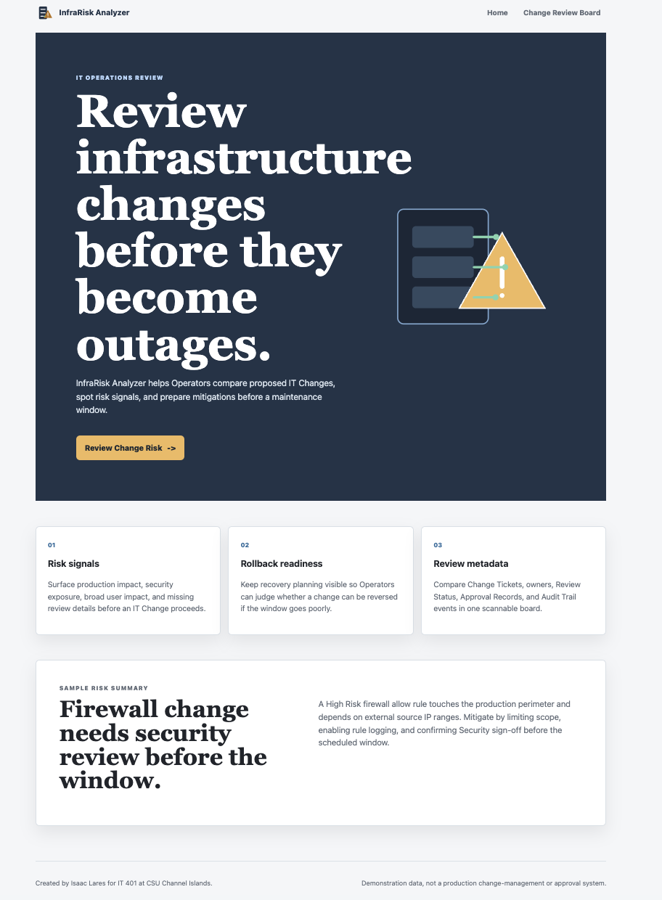
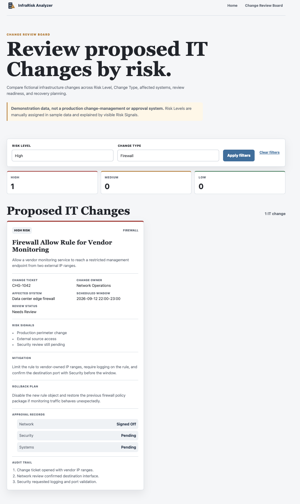
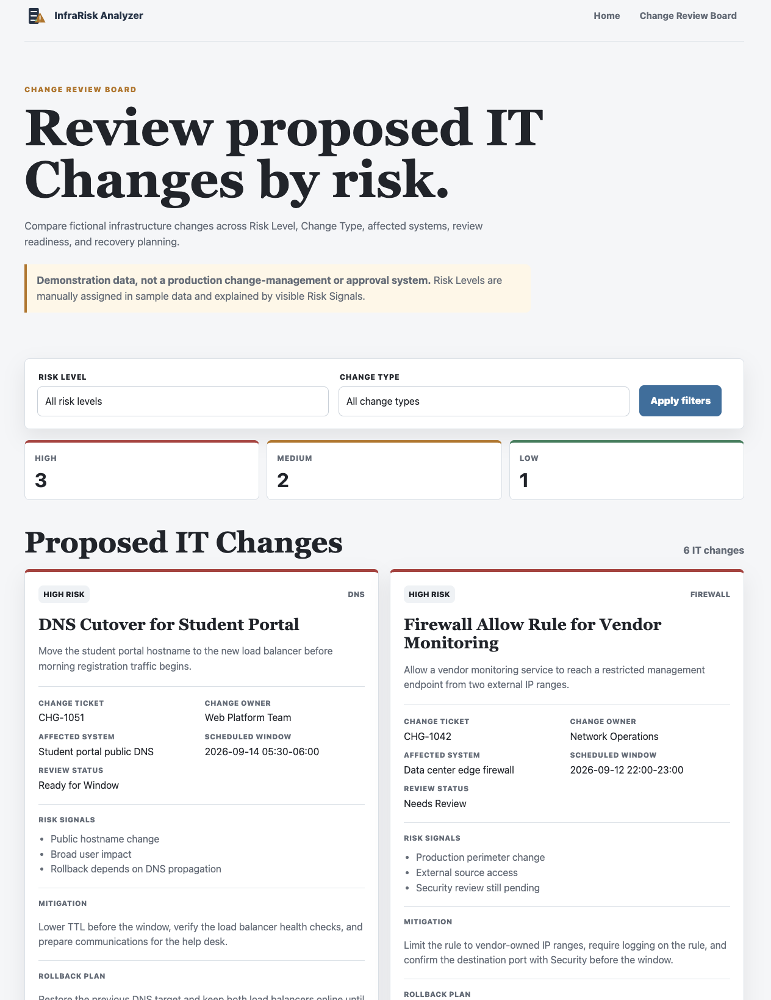

# Isaac Lares, COURSE: IT401, Assignment: A1

# Application Name: InfraRisk Analyzer

# PROJECT OVERVIEW

**Review infrastructure changes before they become outages.**

InfraRisk Analyzer is a Flask application created by Isaac for IT 401 at CSU Channel Islands. It demonstrates how an early-career Operator could review proposed IT Changes, compare Change Risk, and identify mitigations before a scheduled maintenance window.

> **Demonstration data, not a production change-management or approval system.** The IT Changes in this project are fictional. Low, Medium, and High are manually assigned Risk Levels explained by visible Risk Signals.

## Preliminary semester project concept

The semester direction is an IT change-risk analysis tool for infrastructure operations. The project is designed to showcase systems thinking for DevOps, system administration, systems engineering, network engineering, and cybersecurity-adjacent roles.

Assignment 2 adds authenticated, source-attributed NVD evidence to an External Intelligence Review. An Operator submits a CVE Identifier beside a locally stored IT Change; the application retrieves and normalizes the NVD record without changing the manually assigned Risk Level.

Future assignments can extend the foundation with persistent IT Changes, Risk Findings, Approval Records, Audit Trail events, CISA Known Exploited Vulnerabilities evidence, and AI-generated Risk Summaries that highlight missing review items, mitigation gaps, and rollback concerns.

## Intended users

InfraRisk Analyzer is aimed at junior sysadmins, network-ops practitioners, and DevOps learners who need a structured way to review infrastructure changes before they affect production systems.

## Problem addressed

Operational changes often fail because teams miss impact, review, or rollback details before the change window. InfraRisk Analyzer makes those concerns visible in a compact Change Review Board so an Operator can focus on what needs mitigation before escalation.

## Assignment 1 features

- Shared responsive layout with navigation, footer, and an original inline SVG server-rack/warning-triangle logo
- Customized landing page with the project name, tagline, purpose, attribution, capability panels, and Review Change Risk call to action
- Six fictional IT Changes loaded from JSON
- `/explore` presented as a Change Review Board
- Filtering by Risk Level and Change Type using shareable GET parameters
- High-to-Low Risk Level ordering, risk count summary, live result count, clear-filter action, and no-results state
- Dense IT Change cards with Change Ticket, Change Owner, Affected System, Scheduled Window, Review Status, Risk Signals, Mitigation, Rollback Plan, Approval Records, and Audit Trail events
- Validation that rejects unsupported filter values with an HTTP `400` response
- Route-level pytest coverage for display, filters, validation, ordering, metadata, disclaimer, and empty results

## External Information Sources

- **NVD CVE API 2.0** — `https://services.nvd.nist.gov/rest/json/cves/2.0`, queried with the Operator's normalized `cveId`. The review uses the CVE identifier, English description, publication date, best available CVSS metric, and NVD source URL.
- **CISA KEV catalog** — public HTML catalog queried with the normalized CVE Identifier; exact matches are normalized and shown as source-attributed Risk Signals.

NVD attribution is shown in the review. Requests use a finite timeout, the documented API-key header, and a descriptive application User-Agent.

## Application Workflow

1. The Operator selects a locally stored IT Change and enters a CVE Identifier.
2. The route validates and normalizes the identifier, then sends it as NVD's `cveId` parameter.
3. The NVD JSON response is reduced to useful evidence fields and shown beside the selected IT Change.
4. Missing fields and expected source failures become understandable review states; external evidence never mutates local Risk Level or review metadata.

## Environment Variables

`NVD_API_KEY` is required for an acquired NVD review. Copy `.env.example` to `.env` and provide a key from NVD. `.env` is ignored by Git; no real credential belongs in source, tests, logs, or rendered pages.

## Current Features

- Validated External Intelligence Review form for a local IT Change and CVE Identifier
- Authenticated NVD CVE API 2.0 request and normalized evidence display
- Request-time CISA KEV HTML acquisition with exact CVE matching and normalized remediation evidence
- English description, publication date, best available CVSS version/score/severity, source URL, and retrieval context
- Friendly handling for missing credentials, empty results, rate limits, unsuccessful responses, malformed JSON, and network failures
- Existing Change Review Board remains local and manually risk-assigned

## Error Handling

The review returns a configuration state for a missing `NVD_API_KEY`, a not-found state for an empty NVD result, a retry-later state for HTTP 429, and a generic source-unavailable state for other unsuccessful responses, malformed JSON, or network failures. Invalid CVE input is rejected before any outbound request.

## Known Limitations

NVD and CISA KEV evidence are request-time context and are not persisted. The application does not infer whether the selected Affected System runs the vulnerable product or version, and External Intelligence does not approve, block, or change an IT Change. Persistent storage remains future work.

## Information model

InfraRisk Analyzer currently manages fictional IT Changes. Each IT Change has:

- `title`
- `change_type`: Firewall, DNS, Access, Patching, Deployment, or Server Config
- `risk_level`: High, Medium, or Low
- `affected_system`
- `scheduled_window`
- `summary`
- `risk_signals`
- `mitigation`
- `rollback_plan`
- `change_owner`
- `change_ticket`
- `review_status`: Draft, Needs Review, Ready for Window, or Blocked
- `approval_records`
- `audit_trail`

No database schema is required for Assignment 1.

## Run locally

Requires Python 3.10 or newer.

```bash
python3 -m venv .venv
source .venv/bin/activate
pip install -r requirements.txt
python app.py
```

Open [http://127.0.0.1:5000](http://127.0.0.1:5000). Example filtered URL:

```text
http://127.0.0.1:5000/explore?risk_level=High&change_type=Firewall
```

## Test

```bash
python3 -m pytest -q
```

The tests exercise the application through its public HTTP interface. They do not require network access or external credentials.

## Project structure

```text
app.py                       Flask application factory and entry point
config.py                    Environment-aware configuration
data/it_changes.json         Six fictional IT Change records
models/__init__.py           ITChange and ApprovalRecord models
routes/main.py               Home and Change Review Board routes
templates/base.html          Shared document layout
templates/index.html         Landing page
templates/explore.html       Filters, IT Changes, and review metadata
static/style.css             Responsive presentation
tests/test_app.py            Public route behavior tests
docs/screenshots/            Browser-verification captures
docs/submission/             A1 PDF hand-in artifact
```

## Screenshots

### Home page



### Filtered Change Review Board



### Narrow responsive layout



## Future work

Assignment 2 provides an External Intelligence workflow: an Operator enters a CVE Identifier, InfraRisk retrieves NVD vulnerability details, and the application compares them with CISA Known Exploited Vulnerabilities catalog evidence. Assignment 3 can retain timestamped External Intelligence Snapshots with persistent IT Changes, Risk Findings, Approval Records, and Audit Trail events.

Project terminology and data decisions are documented in [`CONTEXT.md`](CONTEXT.md), [`docs/adr/0002-select-infrarisk-analyzer.md`](docs/adr/0002-select-infrarisk-analyzer.md), and [`docs/adr/0003-use-nvd-and-cisa-kev-for-a2-external-intelligence.md`](docs/adr/0003-use-nvd-and-cisa-kev-for-a2-external-intelligence.md).

## Submission artifact

The versioned Assignment 1 report is available at [`docs/submission/InfraRisk-Analyzer-A1.pdf`](docs/submission/InfraRisk-Analyzer-A1.pdf). It is generated from the local HTML submission source before release.
